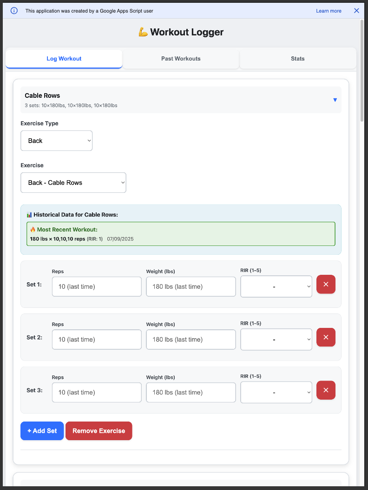

# 💪 Workout Logger

A Google Apps Script application that enhances how you log your workouts in Google Sheets with a modern, mobile-friendly interface.

## Features

- **📱 Mobile-friendly interface** - Optimized for phone and tablet use
- **📊 Exercise history tracking** - See your previous performance for each exercise
- **📈 Progress statistics** - Track sets per muscle group over 4 weeks
- **🔄 Past workout selection** - Easily repeat previous workouts with progression hints
- **⚡ Smart caching** - Fast navigation between tabs during workout sessions
- **📝 Collapsible exercises** - Clean overview of your workout progress

## Sheet Setup
Example sheet: https://docs.google.com/spreadsheets/d/1ltfBNrmnp20fmqguoAoA-br0ZWyYX8_PhTNe65IgOYk/edit?gid=1866146946#gid=1866146946

### Exercises Sheet
Create a sheet named **"Exercises"** with the following format:

| Muscle | Exercise |
|--------|----------|
| Back | Barbell Rows |
| Back | Cable Pull Downs |
| Chest | Bench Press |
| Chest | Incline Press |
| Legs | Squats |
| Legs | Leg Press |

### Stats Sheet  
Create a sheet named **"Stats"** with the following format:

| Exercise | Max | Reps | Date |
|----------|-----|------|------|
| Bench | 280 | 5 | 11/5/2023 |
| Bench | 245 | 8 | 4/15/2025 |
| Bench | 225 | 10 | 6/23/2025 |
| Bench | 225 | 12 | 6/23/2025 |
| Incline Press | 105 | 6 | 9/18/2023 |

### Workouts Sheet
Create a sheet named **"Workouts"** with the following headers. This is where your workouts will be automatically populated:

| Date | Exercise | Muscle | Weight | Reps | Reps in Reserve |
|------|----------|--------|--------|------|-----------------|
| | | | | | |

*This sheet will be automatically filled when you log workouts through the app.*

## App Script Setup

1. **Create a new Google Apps Script project**
   - Go to [script.google.com](https://script.google.com)
   - Click "New Project"

2. **Deploy the files**
   - Replace the default `Code.gs` content with `WorkoutScript.js`
   - Create a new HTML file called `WorkoutForm` and paste the content from `WorkoutForm.html`

3. **Set up your Google Sheet**
   - Create the three sheets as described above: "Exercises", "Stats", and "Workouts"
   - Populate the "Exercises" sheet with your preferred exercises

4. **Deploy as web app**
   - Click "Deploy" → "New Deployment"
   - Choose "Web app" as the type
   - Set execute as "Me" and access to "Anyone"
   - Click "Deploy" and copy the web app URL

5. **Start logging workouts!**
   - Open the web app URL on your phone or computer
   - Begin tracking your fitness journey

## How to Use

### Log Workout Tab
- **Add exercises** by selecting muscle group and specific exercise
- **View exercise history** to see your previous performance
- **Add sets** with reps, weight, and RIR (Reps in Reserve) ratings
- **Collapse/expand exercises** for better organization during long workouts

### Past Workouts Tab
- **View recent workouts** from the previous week or last 5 workouts
- **Select previous workouts** to repeat with progression hints
- **See workout summaries** with muscle groups trained

### Stats Tab
- **Track progress** with 4-week set volume per muscle group
- **Monitor current week** highlighted in green
- **See progression** with week-over-week comparisons

## Technical Details

- **Frontend**: HTML5, CSS3, JavaScript with responsive design
- **Backend**: Google Apps Script (JavaScript)
- **Data Storage**: Google Sheets
- **Mobile Optimization**: Touch-friendly interface with large buttons
- **Caching**: Smart data caching for improved performance
- **Real-time Updates**: Automatic synchronization with Google Sheets

## Benefits

✅ **Track your workouts** anywhere with internet access  
✅ **See your progress** with historical data and statistics  
✅ **Stay motivated** with clear progression tracking  
✅ **Save time** by repeating successful workouts  
✅ **Mobile-first design** perfect for gym use  
✅ **Free to use** with Google's infrastructure  

---

*Built with ❤️ for fitness enthusiasts who want to track their progress effectively*
